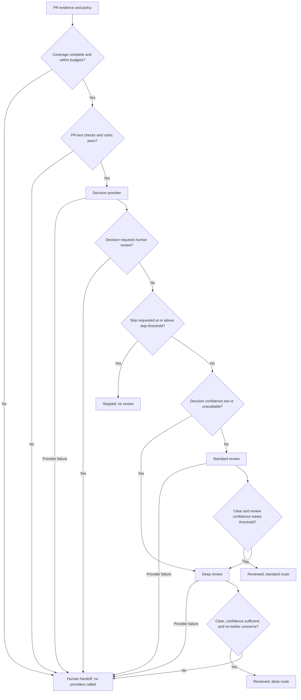

# Offline examples

These files contain fictional, sanitized evidence and require no credentials.

## Diff-review pipeline

The router validates patch coverage before calling any provider. A sound
editorial change can be skipped; uncertain decisions or review results escalate
through deeper review, with unresolved concerns handed to a human.



In this example, `evidence.json` follows the skip path. `concern.json` has a
synthetic finding at both review depths and ends in a human handoff. PR-text
and rubric checks are optional policy gates; their example pipelines are
documented in [PR-text examples](../pr-text/README.md) and
[rubric examples](../rubric/README.md).

```sh
uv run pr-review-router review --input examples/diff/evidence.json --config examples/diff/policy.toml
uv run pr-review-router review --input examples/diff/concern.json --output reports/concern.json
```

- `evidence.json`: correcting a duplicate word in prose documentation returns
  `outcome: "skipped"` and `route: "no_review"`.
- `concern.json`: an added `MOCK_REVIEW_CONCERN` marker creates a synthetic finding.
  Standard and deep review both report concerns, so the final outcome is
  `needs_human_review` with route `human`.
- `policy.toml`: all supported policy keys and their default values.

To exercise the review path for the editorial example, copy the policy and set
`skip_confidence = 1.0`. The mock decision's 0.99 score no longer permits skipping;
standard review clears the narrow editorial correction.

An ordinary source-code change without the synthetic marker returns uncertainty
and ends in a human handoff. Missing patches or exceeded budgets require human
review before any provider is called.

Every result is advisory and labels mock confidence explicitly. CLI status 0
means report generation succeeded, including human handoffs. It does not imply
approval. See the [specification](../../docs/specification.md) for the complete schema.

Store private evidence and generated reports outside version control. The
`reports/` directory is ignored; these sanitized fixtures remain tracked.
