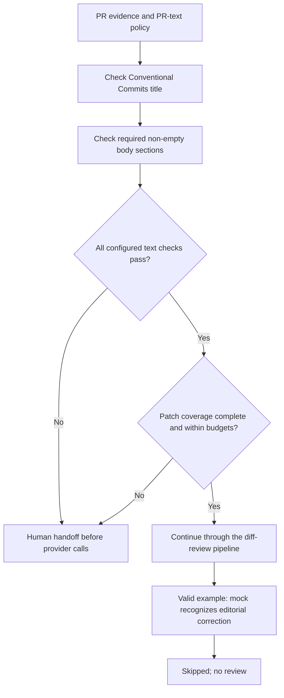

# PR title and description format examples

These examples apply explicit PR-text rules through a TOML policy:

- Titles must use the Conventional Commits shape `type(scope): description`.
  Scope is optional, and breaking changes may use `!` before the colon.
- The description must contain non-empty level-two `## Summary` and
  `## Testing` sections.

## PR-text validation pipeline

Text checks run before provider review and do not replace patch-coverage
validation. Any format failure is reported and handed off without calling a
provider; passing checks continue through the common diff-review route.



`invalid.json` fails both its title-format check and its empty `## Testing`
section, so it is handed off early. `valid.json` passes these checks and its
narrow editorial change is skipped by the offline mock.

Run both examples with the same policy:

```sh
uv run pr-review-router review --input examples/pr-text/valid.json --config examples/pr-text/policy.toml
uv run pr-review-router review --input examples/pr-text/invalid.json --config examples/pr-text/policy.toml
```

`valid.json` passes the PR-text checks and its narrow documentation diff is
skipped by the offline mock. `invalid.json` fails because its title is not in
Conventional Commits format and its `## Testing` section is empty. It is handed
off before any review provider is called. Inspect `pr_text` in each report for
the check status and issues; diff coverage is reported separately.

The format settings are optional and disabled by default. Set
`title_format = "any"` to leave titles unrestricted, and omit
`required_body_sections` when the description has no required headings. These
checks validate only the configured text format: they do not determine whether
the title or description accurately describes the code change, edit the PR, or
approve it.

The same pre-provider gate can be extended with `nonsemantic_checks` for
repository-specific deterministic rules. Regex checks can inspect `title`,
`body`, `patch`, or `file_paths`; script checks receive the validated evidence
JSON on standard input and pass only when their command exits with status zero.
See the policy format in the main [README](../../README.md). Failed checks are
reported under `nonsemantic_checks` and hand the PR off without provider calls.
