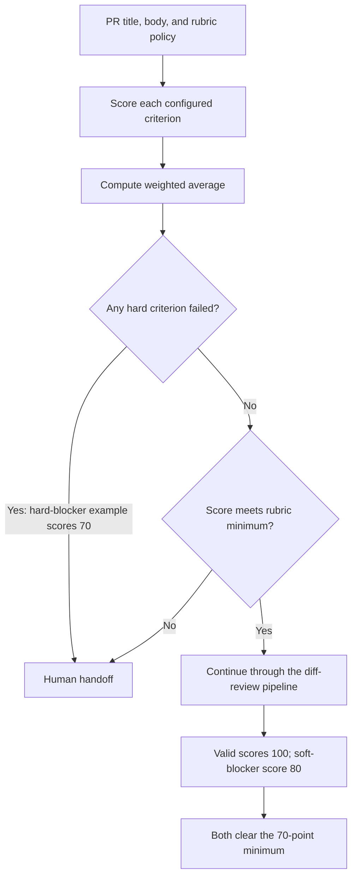

# Rubric-based PR-text examples

This set demonstrates multiple weighted criteria rather than a single format
gate. Rubric scoring is a deterministic policy check, not a model/provider
role: it evaluates configured title/body text before any provider is called and
does not assess whether that text accurately describes the diff. The policy
scores each criterion from 0–100, multiplies by its weight, then calculates a
weighted average. A failed hard blocker always requires a human handoff. Soft
failures are reported and reduce the score; the PR is handed off if the
aggregate falls below `rubric_minimum_score`.

## Rubric evaluation pipeline

Each configured title/body criterion is scored and checked against its
`pass_score`. Hard failures hand off regardless of the aggregate score; otherwise
the weighted minimum decides whether the PR continues to the common diff-review
route.



The hard-blocker example is handed off even though its aggregate score is
exactly 70, because the required Testing criterion failed. The soft-blocker
example scores 80 and passes the configured minimum.

```sh
uv run pr-review-router review --input examples/rubric/valid.json --config examples/rubric/policy.toml
uv run pr-review-router review --input examples/rubric/soft_blocker.json --config examples/rubric/policy.toml
uv run pr-review-router review --input examples/rubric/hard_blocker.json --config examples/rubric/policy.toml
```

- `valid.json` satisfies all four criteria and scores 100.
- `soft_blocker.json` omits the optional risk note, scores 80, and still clears
  the 70-point minimum. Its failed soft criterion appears in the report.
- `hard_blocker.json` omits the required Testing section. Despite scoring 70,
  it is handed off because a hard blocker failed.
- `policy.toml` defines the criteria, weights, blocker types, and overall
  minimum score.

Supported deterministic checks are `non_empty`, `min_words`, `contains`, and
`section_nonempty`. These inspect only supplied title/body text; they do not
judge semantic accuracy or whether the description matches the diff. They are
an offline mock for exercising rubric-based routing, not an AI system that
judges the change itself.

Each report includes `rubric.score`, `rubric.minimum_score`, individual
criterion scores and explanations, failed hard blockers, and failed soft
criteria. The separate `pr_text` field continues to report any enabled
Conventional Commits/required-section format checks.
